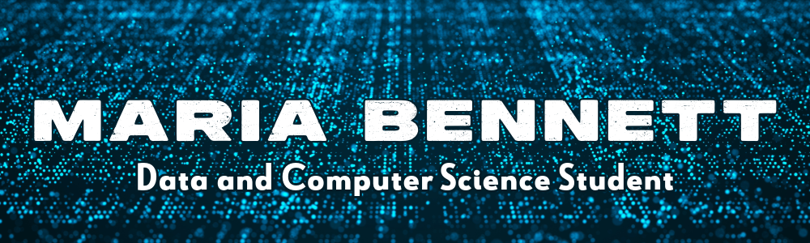

 

<h2>
Using computer and data science to solve meaningful problems and create solutions that make a difference for individuals and communities.
</h2>

<h3>Key Skills:</h3>
<ul>
  <li>Machine Learning/Deep Learning (Python/PySpark)</li>
  <li>Data ETL, Visualization, Communication, and Training</li>
  <li>SQL</li>
  <li>JavaScript, C#, C++</li>
  <li>HTML/CSS</li>
</ul>

You can find me on <a href = "https://www.linkedin.com/in/maria-bennett-dev/">
  <image src = "https://github.com/mariabennett-dev/mariabennett-dev/blob/main/li.png" width = "18px"/>
  </a>
  or .

